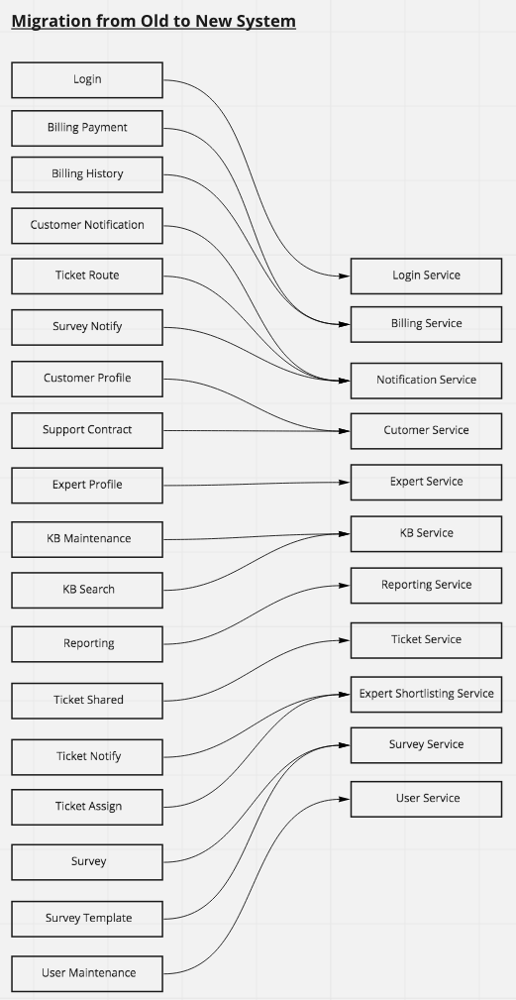

### Pre-requisites
1. Automated regression test suite.

### Migration Approach
The current application is a monolith and in a hard to maintain state, where changes take a long time and are error prone. To mitigate the problems with current application, the proposed new application architecture consists of microservices that primarily communicate with each other asynchronously using a message bus. 

#### Migration Sequence
As described in [here](MinimumViableProduct.md), migration will first target the ticket creation/updating flow so that the problem of lost tickets is resolved. Next, the ticket assignment flow will be targeted to ensure that the right experts pick up the tickets. At this point we would have the microservices - Ticket Service and Expert Shortlisting Service which target the most pressing problems of the existing application. The subequent micro services will be moved gradually in a series of MVPs.

#### Development
During the development phase,
- Development needs to be done for the components shown below in the Component Mapping table.
- For every component, an automation test suite that tests all its functionality needs to be built.
- Existing components which will get reused, need to be modified to work as microservices that use asynchronous communication and a separate database with data as shown in the Database Mapping section. For existing components, test suite needs to compare the test results for the old implementation with the new one and fixes need to go in, where appropriate.
- Test suite should also cover the integration work flows between the microservices.
- The entire application needs to be run in trial mode for select beta customers.

#### Deployment
The deployment of the new solution involves the following to be done during the off-business hours:
1. Stop the old application services.
1. Migrate the data from the database of the old application to the new microservice-specific databases. The table mapping details are given in the "Database Mapping" section below.
1. After the migration is complete, start the new microservices.

#### Existing to new Components Mapping

| # | Existing Systems's Component | New System's Component | Action |
|----|----|----|----|
|1.  | Login                 | Login Service         | Rename of the service                         |
|2.  | Billing Payment       | Billing Service       | Merged into new service                       |
|3.  | Billing History       | Billing Service       | Merged into new service                       |
|4.  | Customer Notification | Notification Service  | New Service for all notifications             |
|5.  | Ticket Notify         | Notification Service  | New Service for all notifications             |
|6.  | Survey Notify         | Notification Service  | New Service for all notifications             |
|7.  | Customer Profile      | Customer Service      | Merged into new service                       |
|8.  | Support Contract      | Customer Service      | Merged into new service                       |
|9.  | Expert Profile        | Expert Service        | Rename of the service                         |
|10. | KB Maintenance        | KB Service            | Merged into new service                       |
|11. | KB Search             | KB Service            | Merged into new service                       |
|12. | Reporting             | Reporting Service     | Rename of the service                         |
|13. | Ticket Shared         | Ticket Service        | Merged into new service                       |
|14. | Ticket Assign         | Ticket Service        | Changed ticketing business process -> ADR.003 |
|15. | Ticket Route          | Expert Shortlisting Service        | Redesign functionality                        |
|16. | Survey                | Survey Service        | Merged into new service                       |
|17. | Survey Template       | Survey Service        | Merged into new service                       |
|18. | User Maintenance      | User Service          | Rename of the service                         |

#### Database Mapping
| # | Existing DB Table | New DB |
|----|----|----|
|1.  | ss.Customer                   | Customer DB, Billing DB, Ticket DB, Survey DB |
|2.  | ss.Customer_Notification      | Notification DB, Customer DB  |
|3.  | ss.Survey                     | Survey DB, Report DB  |
|4.  | ss.Survey_Question            | Survey DB  |
|5.  | ss.Customer_Survey            | Survey DB, Report DB  |
|6.  | ss.Customer_Survey_Question   | Survey DB  |
|7.  | ss.Customer_Survey_Response   | Survey DB  |
|8.  | ss.Billing                    | Billing DB, Report DB |
|9.  | ss.Contract                   | Billing DB, Report DB |
|10. | ss.Payment_Method             | Billing DB |
|11. | ss.Payment                    | Billing DB |
|12. | ss.SysOps_User                | Expert DB, Ticket DB, Notification DB, Knowledge Base DB, Report DB, Survey DB, Expert Shortlist DB, User DB  |
|13. | ss.Profile                    | Expert DB, Report DB, User DB  |
|14. | ss.Expert_Profile             | Expert DB, Expert Shortlist DB, Report DB  |
|15. | ss.Expertise                  | Expert DB, Expert Shortlist DB, Report DB  |
|16. | ss.Location                   | Expert DB, Expert Shortlist DB  |
|17. | ss.Article                    | Knowledge Base DB, Report DB  |
|18. | ss.Tag                        | Knowledge Base DB  |
|19. | ss.Keyword                    | Knowledge Base DB  |
|20. | ss.Article_Tag                | Knowledge Base DB  |
|21. | ss.Article_Keyword            | Knowledge Base DB  |
|22. | ss.Ticket                     | Ticket DB, Report DB  |
|23. | ss.Ticket_Type                | Ticket DB, Report DB |
|24. | ss.Ticket_History             | Ticket DB, Knowledge Base DB, Report DB  |
