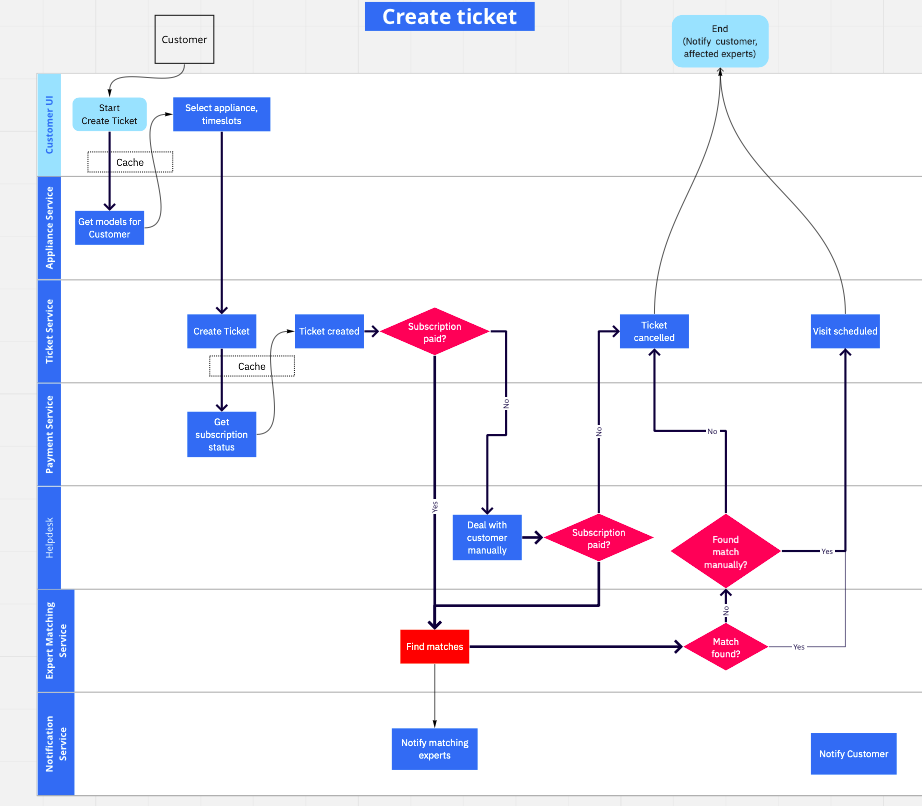
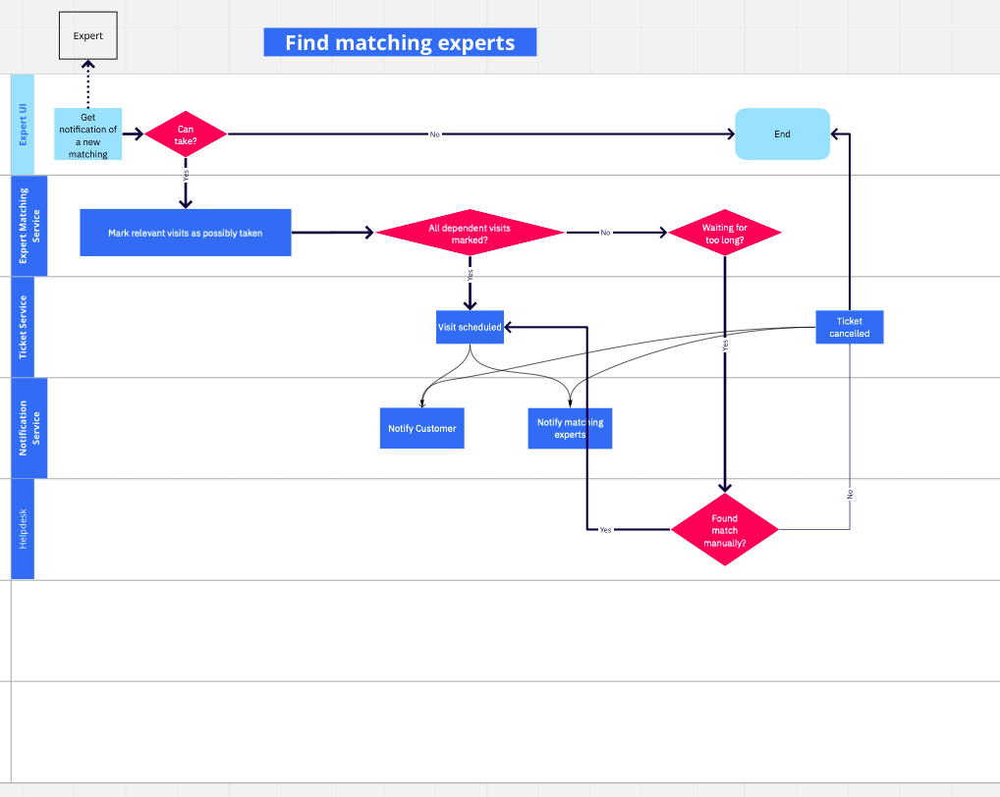
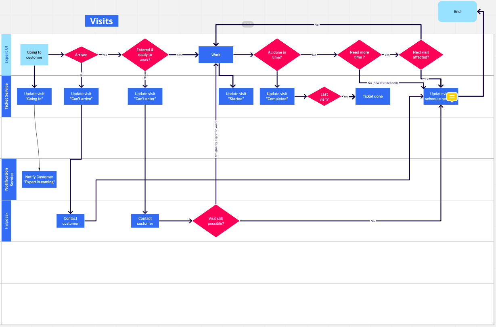

# Important scenarios
## Ticket creation

### Stakeholders
* Customer - Interested in entering a ticket the fastest and easiest way, get it assigned to experts, and executed in a timely fashion
* Expert - Interested in receiving available tickets to execute and be paid for those
* Helpdesk/Admin - Interested in most automation and error-proof process

### Risks

* Login service can be down (not shown here) - it's duplicated under load-balancer cluster
* Appliance service can be down - the Customer can't see a list of models and pick his model. Solutions:
  * The Customer UI service has a cache of appliances, so the problem is only if there is a new model not yet propagated to the cache.
  * For that unlikely scenario, Customer can always use a free-text to specify a model
* Payment service can be down - we don't know if Customer has paid his monthly subscription charge. Solutions:
  * Cache for the paid customers in the Ticket service - only the the unlikely case that the Customer paid while the Payment data service was down gives trouble
  * If the payment data is not in the cache - the ticket is still created but flagged for the Helpdesk attention who will either resolve the problem on the backend or contact the Customer and resolve the issue with them directly
* Hard to implement a good algorithm to match Experts to tickets. Solution:
  * Let Experts see the available tickets matching their skillset, and match themselves to a ticket (we call it "UBER model"). This insentivises the Experts to reply to tickets faster and have more tickets done.
* No Experts matched for a ticket. Solution:
  * Wait the match to happen within pre-configured time. If it takes too long, then
  * Helpdesk/Admin/Manager takes care of the communication with the available Experts to get the ticket assigned.

## Ticket-to-expert matching

### Stakeholders
* Customer - Interested in having the ticket assigned to experts and executed in a timely fashion
* Expert - Interested in receiving available tickets to execute and be paid for those
* Helpdesk/Admin - Interested in most automation and error-proof process

### Risks

* A ticket may require multiple visits, or a joint visit my multiple experts, or visits happening one right after another (e.g. plumber and electrician). Solution:
  * We introduce a new entity - Visit. A ticket has 1..N visits. Each visit can have multiple experts (which can be converted to multiple tickets in the backend), and there can be time dependency between them.
* There can be specific patterns that are hard to match in one try. Solution:
  * Each Expert who would like to do a visit proposes himself to all the times that would work for him. There can be several Experts attaching themselves to a visit.
  * When a group of dependent visits is full, the Experts attachment is finalized based on 1) the earlist visit for a Customer; 2) time priority for Experts. At this time, a notification is sent both to the Customer and to the finalized Experts who will go to execute the visit.
* There are available Experts but their time slots don't match the Customer's. Solution:
  * When visits are not matched for some time, Helpdesk contacts the Customer and explains the situation and proposes available timeslots of Experts. If the Customer agrees to the time change, the visit is updated and Experts for a visit are finalized.
    * This can be automated later.

## Ticket execution (visits)

### Stakeholders
* Customer - Interested in ticket executed in a timely fashion
* Expert - Interested in executing a ticket without problems
* Helpdesk/Admin - Interested in most automation and error-proof process

### Risks
* Expert can't arrive to the Customer's place due to an accident. Solution:
  * If time permits and Expert is replaceable (i.e. any Expert of the desired skillset can come), Helpdesk finds and sends a replacement, otherwise notifies the Customer and reschedules the visit.
* Expert arrived but can't enter (nobody's home). Solution:
  * Helpdesk contacts the Customer and resolves the situation (possibly rescheduling the visit)
* Expert can't finish job in time. Solutions:
  * If more time needed and time permits (i.e. no later visits for other Customers affected), Expert stays longer and completes the visit.
  * If there is no time, or it's impossible to finish because the needed spare parts need to be bought, Customer schedules a new visit, possibly with a help of Helpdesk.

